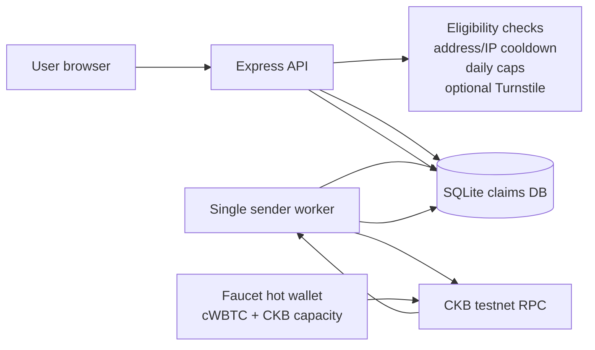
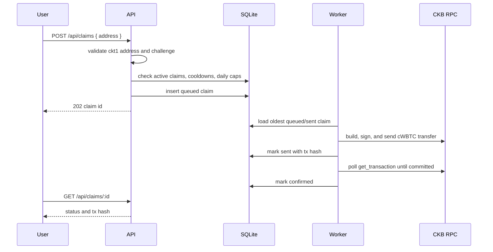

# cWBTC Faucet

Public testnet faucet for `cWBTC`, the CKB xUDT used as fake wrapped BTC in the Fiber CCH demo. It is a plain testnet UDT with 8 decimals. For the demo convention, `1 raw cWBTC = 1 satoshi`, so `1 cWBTC = 100,000,000 raw units`.

## Existing cWBTC

The original issuance artifacts are still present locally:

- Workspace copy: `/Users/retric/Documents/Codex/2026-07-06/ban/work/cch-wbtc-udt`
- Desktop copy: `/Users/retric/Desktop/cch-wbtc-udt`
- Issuer file: `issuer.json` has the issuer private key field.
- Issue result: `issue-result.json`

Do not deploy the issuer key directly. Fund a dedicated faucet hot wallet with cWBTC plus enough CKB capacity, then mount that hot-wallet key as the `faucet_private_key` Docker secret.

Token details:

```json
{
  "name": "CCH Wrapped BTC",
  "symbol": "cWBTC",
  "decimals": 8,
  "supply_raw": "340282366920938463463374607431768211455",
  "type_script": {
    "code_hash": "0x25c29dc317811a6f6f3985a7a9ebc4838bd388d19d0feeecf0bcd60f6c0975bb",
    "hash_type": "type",
    "args": "0x9a1086531ed6dc69e0bd44cef5278e03faf3015b31aff60b08fb87663ce8507100000000"
  }
}
```

## Architecture



The important operational detail is the worker. CKB UDT transfers spend a live cell and create a change cell. If the faucet sends concurrent transactions from the same cWBTC cell, one of them will conflict. This service stores claims in SQLite, sends one transaction at a time, and waits until the transaction is committed before sending the next one.

## Claim Flow



## Anti-Sybil v1

This is intentionally modest, but it is durable enough for a real public testnet service:

- one pending claim per address
- address cooldown
- IP cooldown using salted IP hashes
- per-address daily cap
- per-IP daily cap
- global daily cap
- optional Cloudflare Turnstile
- persistent claim history across restarts

The next natural upgrade is Redis/Postgres plus Turnstile enabled by default. If abuse appears, add GitHub OAuth or require a small CKB capacity proof before claiming.

## Run Locally

```bash
npm install
cp .env.example .env
npm run dev
```

The server listens on `http://localhost:3008` by default and serves both the API and the small faucet page.

For local worker testing, set `FAUCET_PRIVATE_KEY_FILE` to a file containing a dedicated faucet hot-wallet key. Direct secret environment variables remain supported for backward compatibility, but file-based secrets take precedence.

Useful endpoints:

- `GET /health`
- `GET /api/info`
- `GET /api/balance`
- `POST /api/claims`
- `GET /api/claims/:id`
- `GET /api/admin/summary` with `Authorization: Bearer $ADMIN_TOKEN`

## Run With Docker

Docker Compose is the recommended production runtime. It runs the service as the unprivileged `node` user, checks `/health`, and persists SQLite state in the `faucet-data` volume.

```bash
./scripts/init.sh
# Fund the printed address with testnet cWBTC and CKB first.
docker compose up -d --pull always --no-build
docker compose ps
```

The initializer copies `.env.example` to `.env`, creates a dedicated faucet hot wallet, and generates the other runtime secrets. It is safe to rerun and does not overwrite existing values. It prints only the public CKB testnet address; the private key stays in `secrets/faucet_private_key` with mode `0600`.

Before a public launch, set `PUBLIC_BASE_URL` and `CORS_ORIGIN` in `.env`. Compose mounts the secret files read-only under `/run/secrets`; raw secret values are not included in the container environment. For a production host, the same files can later be moved to the team's secret manager without changing the application.

For local development, replace the pull and start commands with `docker compose up -d --build` to build the image from the current checkout.

The service is exposed on port `3008`. Set `FAUCET_PORT` in `.env` when the host port needs to differ. SQLite lives at `/app/data/faucet.sqlite` inside the named volume and survives image replacement or container recreation.

Run exactly one worker-enabled replica. The current queue and SQLite database are designed for one serialized CKB sender; horizontal scaling requires a shared database and a distributed worker lock.

To inspect logs or stop the service:

```bash
docker compose logs -f faucet
docker compose down
```

Do not add `-v` to `docker compose down` unless the claim history is intentionally being deleted.

## Container Publishing

GitHub Actions runs the TypeScript checks and publishes `ghcr.io/retricsu/cwbtc-faucet` to GitHub Container Registry:

- pushes to the default branch publish `ghcr.io/retricsu/cwbtc-faucet:latest` and an immutable `sha-*` tag
- tags such as `v0.1.0` publish `0.1.0` and `0.1` image tags
- pull requests run checks without publishing an image
- published manifests support both `linux/amd64` and `linux/arm64`
- every published image includes a GitHub artifact provenance attestation

The workflow uses the repository-scoped `GITHUB_TOKEN`; no long-lived registry password is required. For predictable production deploys, use the `sha-*` tag or image digest rather than `latest`.

## Deployment Notes

1. Run `./scripts/init.sh` and copy the printed public faucet address.
2. Transfer cWBTC from the issuer wallet to that address.
3. Deposit enough CKB into the address. Each claim creates an xUDT cell and costs roughly 200 CKB of occupied capacity plus tx fees.
4. Set the public URL values in `.env`, then start the service:

```bash
docker compose up -d --pull always --no-build
```

Monitor:

- `GET /api/balance` for rough claim capacity.
- `GET /api/admin/summary` for stuck or failed claims.
- process logs for worker errors.

If a claim is stuck in `sent`, the worker will retry confirmation polling on restart. If it is stuck in `processing` after a crash before sending, inspect logs and either mark it `queued` manually or mark it `failed` in SQLite.

See [docs/OPERATIONS.md](docs/OPERATIONS.md) for the handoff runbook.

## Dependency Note

The faucet uses `@ckb-ccc/ccc`, matching the original cWBTC issuance scripts. `npm audit --omit=dev` currently reports low-severity transitive findings in CCC's wallet adapter dependency chain; recheck before public launch and upgrade CCC when a clean release is available.
